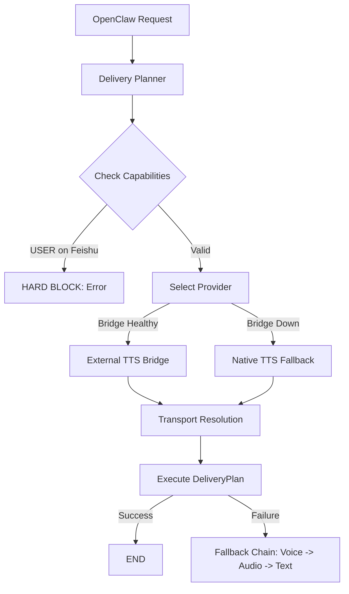

# OpenClaw TTS Bridge: Integration & Runtime Instructions

This document is the authoritative reference for **OpenClaw** operators and integrators. It covers the deterministic delivery architecture, API contract, and safety policies.

---

## 1. Deterministic Delivery Architecture

To eliminate instability, ALL audio delivery MUST follow this deterministic pipeline:



---

## 2. Capability Matrix (Hard-coded)

| Channel | Bot Audio | User Audio | Voice Bubble | Audio File | Format |
| :--- | :--- | :--- | :--- | :--- | :--- |
| **Feishu** | ✅ | ❌ (Blocked) | ✅ (Opus) | ❌ | OGG/Opus |
| **Telegram** | ✅ | ✅ | ✅ (sendVoice) | ✅ (sendAudio) | OGG/Opus |
| **Other** | ✅ | ✅ | ❌ | ✅ | WAV |

---

## 3. API Reference (POST `/tts`)

**Auth**: `Authorization: Bearer <INTERNAL_TTS_TOKEN>`

**Response Header**: `X-Request-Id: <uuid>` — must be used for tracing.

**Response Variants**:
- **Status 200 (Binary)**: Audio bytes for Telegram/Standard.
- **Status 200 (JSON)**: `{"msg_type": "audio", "content": {"file_key": "..."}}` (Feishu).
- **Status 200 (Fallback JSON)**: `{"fallback_to_text": true, "reason": "..."}`.

---

## 4. Integration Contract (MANDATORY)

Integrators MUST consume the `DeliveryPlan` generated by the middleware.

```python
# Pseudo-code for OpenClaw Orchestrator
plan = decide_audio_delivery(
    request_id=uuid(),
    channel=channel,
    sender_type=sender_type, # MUST be explicit: "bot" or "user"
    text_length=len(text)
)

if plan.status == "blocked":
    raise SecurityError(f"Audio forbidden for {plan.sender_type} on {plan.channel}")

# Execute synthesis based on plan.tts_provider
if plan.tts_provider == "bridge":
    result = await call_bridge(..., url=plan.bridge_url)
    if result.is_error:
        # Step through plan.fallback_chain
        next_attempt = get_next_fallback(plan, plan.resolved_type)
        ...
```

---

## 5. Failure & Observability

### 5.1 No Silent Failures
- Every failed synthesis OR delivery attempt MUST be logged with `request_id`.
- Every fallback to text MUST include a `reason_code` (e.g., `bridge_timeout`, `feishu_upload_err`).

### 5.2 Required Log Fields
- `request_id`
- `tts_provider` (bridge | native)
- `sender_type` (bot | user)
- `resolved_type` (voice_bubble | audio_file | text)
- `latency_ms`

---

## 6. Operational Checklist
- [ ] `FEISHU_APP_ID/SECRET` verified for bot-only audio.
- [ ] `TTS_HOST=127.0.0.1` for local bridge security.
- [ ] `ffmpeg` installed (required for OPUS/OGG).
- [ ] Health check monitor active for external bridge.
